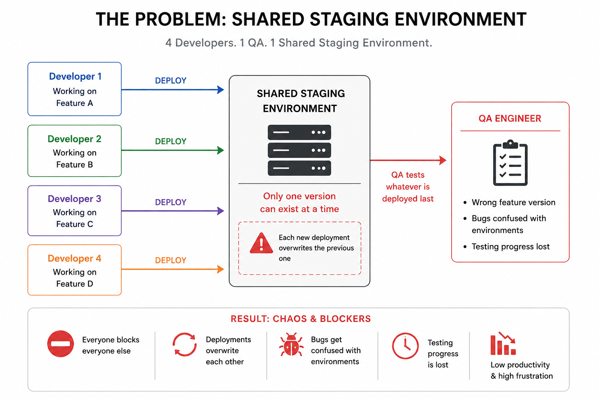
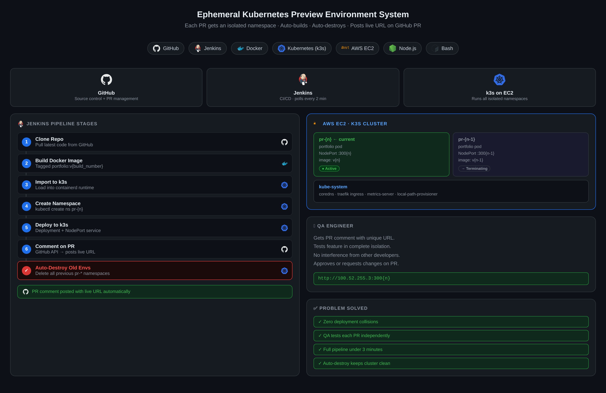
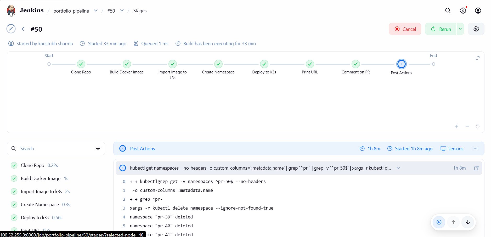

# Ephemeral Kubernetes Preview Environment System

[](https://jenkins.io)
[](https://k3s.io)
[](https://docker.com)
[](https://aws.amazon.com)
[](https://github.com)

---

## The Problem

> 4 developers. 1 QA. 1 shared staging environment.

When Developer 1 deploys their feature, it **overwrites Developer 2's code** that QA is actively testing. Progress is lost. Bugs get confused with environments. Everyone blocks everyone else.



---

## The Solution

Every Pull Request automatically gets its own **isolated Kubernetes namespace** with a unique live URL. QA tests each feature independently. Developers never block each other. Environments are destroyed automatically when no longer needed.



---

## Demo

### Pipeline Running in Jenkins


### PR Comment with Live URL


### Live Preview Environment


### Multiple Isolated Namespaces


---

## Architecture

```
Developer pushes code to GitHub
            ↓
    Jenkins detects change
    (polls every 2 minutes)
            ↓
    Docker image built
    tagged as portfolio:v{n}
            ↓
    Image imported to k3s
    containerd runtime
            ↓
    Kubernetes namespace created
    pr-{build_number}
            ↓
    ┌─────────────────────────┐
    │  namespace: pr-{n}      │
    │  ├── Deployment         │
    │  │   └── portfolio pod  │
    │  └── NodePort Service   │
    │      └── port: 300{n}   │
    └─────────────────────────┘
            ↓
    Live URL posted as
    GitHub PR comment
            ↓
    Previous namespaces
    auto-destroyed
```

---

## How It Works — Step by Step

| Step | What Happens |
|------|-------------|
| 1 | Developer opens a PR or pushes to a branch |
| 2 | Jenkins detects the change via GitHub polling |
| 3 | Fresh Docker image built from latest code |
| 4 | Image imported into k3s container runtime |
| 5 | New Kubernetes namespace `pr-{n}` created |
| 6 | App deployed inside isolated namespace |
| 7 | NodePort service exposes app on unique port |
| 8 | Jenkins posts live URL on GitHub PR via API |
| 9 | QA tests at unique URL — zero interference |
| 10 | Old namespaces destroyed automatically |

---

## Tech Stack

| Layer | Technology | Purpose |
|-------|-----------|---------|
| Cloud | AWS EC2 (c7i-flex.large) | Host the entire system |
| Orchestration | Kubernetes (k3s) | Run isolated environments |
| CI/CD | Jenkins | Automate the pipeline |
| Containers | Docker | Build and package the app |
| Runtime | k3s containerd | Run containers in K8s |
| Source Control | GitHub | Code + PR management |
| Automation | GitHub API + curl + jq | Post PR comments |
| Persistence | systemd services | Fix permissions on restart |

---

## Repository Structure

```
Portfolio-Website/
├── server.js                   ← Node.js backend (port 3000)
├── public/                     ← Frontend HTML/CSS/JS
│   ├── index.html
│   ├── styles.css
│   └── app.js
├── package.json                ← Dependencies
├── Dockerfile                  ← Container build instructions
├── Jenkinsfile                 ← CI/CD pipeline definition
└── k8s/
    ├── deployment.yaml         ← Kubernetes deployment manifest
    ├── service.yaml            ← NodePort service manifest
    └── ingress.yaml            ← Ingress config (planned)
```

---

## Pipeline Stages

```
Clone Repo → Build Image → Import to k3s → Create Namespace
     → Deploy → Print URL → Comment on PR → Cleanup
```

### Jenkinsfile Overview

```groovy
pipeline {
    environment {
        NAMESPACE = "pr-${BUILD_NUMBER}"  // isolated per build
        IMAGE_TAG = "v${BUILD_NUMBER}"    // versioned image
    }
    stages {
        stage('Clone Repo')      { ... } // pull latest code
        stage('Build Image')     { ... } // docker build
        stage('Import to k3s')   { ... } // load into containerd
        stage('Create Namespace'){ ... } // kubectl create namespace
        stage('Deploy')          { ... } // apply k8s manifests
        stage('Print URL')       { ... } // echo live URL
        stage('Comment on PR')   { ... } // post to GitHub API
    }
    post {
        always { ... } // auto-destroy old namespaces
    }
}
```

---

## Key Features

### 🔒 Namespace Isolation
Each build gets its own `pr-{n}` namespace. Completely isolated — different IP space, different pods, different service ports. Dev 1 and Dev 2 can deploy simultaneously with zero conflict.

### ⚡ Auto-Deploy
Jenkins polls GitHub every 2 minutes. Any new commit triggers the full pipeline automatically. No manual button clicking.

### 🗑️ Auto-Destroy
Previous namespaces are deleted at the end of every build. Only the latest environment stays alive. No stale environments accumulating.

### 💬 PR Comments
Jenkins calls the GitHub API to post the live preview URL directly on the open PR. QA knows exactly where to test without asking anyone.

### 🔄 Permission Persistence
Custom systemd services (`k3s-permissions.service`, `k3s-kubeconfig.service`) ensure k3s permissions survive server restarts automatically.

---

## Setup & Installation

### Prerequisites
- AWS EC2 instance (Ubuntu 22.04+, minimum 2 vCPU / 4GB RAM)
- Docker installed
- Jenkins installed and running
- GitHub repository

### 1. Install k3s

```bash
curl -sfL https://get.k3s.io | sh -
sudo chmod 644 /etc/rancher/k3s/k3s.yaml
```

### 2. Give Jenkins access to k3s

```bash
sudo usermod -aG docker jenkins
sudo chmod 666 /run/k3s/containerd/containerd.sock
sudo mkdir -p /var/lib/jenkins/.kube
sudo cp /etc/rancher/k3s/k3s.yaml /var/lib/jenkins/.kube/config
sudo chown -R jenkins:jenkins /var/lib/jenkins/.kube
```

### 3. Set up permission persistence

```bash
# Create systemd service for kubeconfig permissions
sudo nano /etc/systemd/system/k3s-kubeconfig.service
# Add service that runs: chmod 644 /etc/rancher/k3s/k3s.yaml

# Create systemd service for containerd socket
sudo nano /etc/systemd/system/k3s-permissions.service
# Add service that runs: chmod 666 /run/k3s/containerd/containerd.sock

sudo systemctl daemon-reload
sudo systemctl enable k3s-kubeconfig.service k3s-permissions.service
```

### 4. Add Jenkins Credentials

Go to **Jenkins → Manage Jenkins → Credentials → System → Global**

Add a **Secret text** credential:
- ID: `pr-comment`
- Secret: your GitHub Personal Access Token (needs `repo` scope)

### 5. Create Jenkins Pipeline

- New Item → Pipeline
- Build Triggers: Poll SCM → `H/2 * * * *`
- Pipeline: paste contents of `Jenkinsfile`
- GitHub Project URL: your repo URL

### 6. Open Security Group Ports

| Port | Purpose |
|------|---------|
| 22 | SSH |
| 8080 | Jenkins UI |
| 30000-32767 | Kubernetes NodePort range |

---

## Results

- ✅ Zero deployment collisions between parallel developers
- ✅ QA tests each feature at a unique isolated URL
- ✅ Full pipeline runs in under 3 minutes
- ✅ Live URL automatically posted on every PR
- ✅ Old environments cleaned up automatically
- ✅ Single EC2 instance runs 4+ parallel environments

---

## Planned Enhancements

- [ ] **NGINX Ingress** — human-readable URLs (`pr-{n}.domain.com`)
- [ ] **cert-manager + Let's Encrypt** — automatic HTTPS
- [ ] **Neon PostgreSQL branching** — per-PR isolated databases
- [ ] **KEDA scale-to-zero** — idle environments scale down to zero pods
- [ ] **HashiCorp Vault + ESO** — zero secrets in Git
- [ ] **Auto-destroy on PR close** — webhook triggered cleanup
- [ ] **GitHub Actions migration** — replace Jenkins with GHA

---

## Screenshots

> Add your screenshots to `docs/images/` folder

| Screenshot | Description |
|-----------|-------------|
| `banner.png` | Project hero image |
| `problem.png` | Before — shared staging collision |
| `solution.png` | After — isolated namespaces |
| `jenkins-pipeline.png` | Jenkins pipeline stages |
| `pr-comment.png` | GitHub PR with live URL comment |
| `live-preview.png` | Portfolio running in preview env |
| `namespaces.png` | `kubectl get namespaces` output |

---

## What I Learned

- Kubernetes namespace isolation as environment boundaries
- Jenkins declarative pipeline syntax and credential management
- GitHub API integration for automated PR commenting
- Docker image lifecycle — build, tag, import into k3s containerd
- systemd service creation for permission persistence
- Debugging K8s pod networking, NodePort binding, namespace termination
- Real DevOps problem solving under constraints (free tier infrastructure)

---

## Author

**Kaustubh Sharma**
[](https://github.com/kaustubh3023)

---

*Built as a portfolio project demonstrating real DevOps engineering — solving an actual team bottleneck with production-grade Kubernetes tooling on live cloud infrastructure.*
